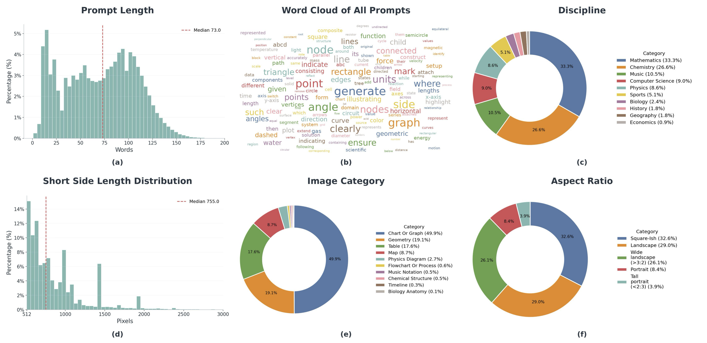
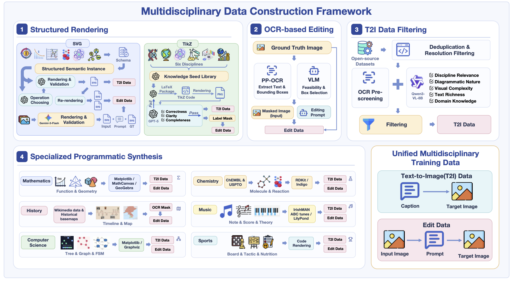
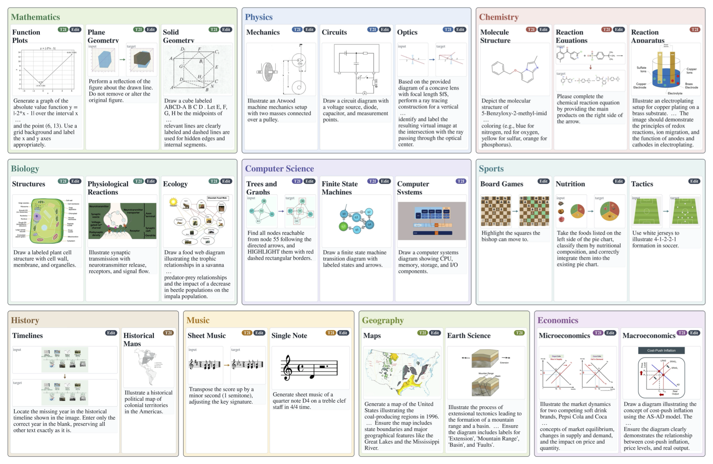

# DisciplineGen-1M: A Large-Scale Dataset for Multidisciplinary Visual Generation and Editing

<p align="center">
  <a href="https://arxiv.org/abs/2607.02290"></a>
  <a href="https://huggingface.co/datasets/VisionXLab/DisciplineGen-1M"></a>
  
</p>

<p align="center">
  <strong>Zhaokai Wang</strong><sup>1*</sup>, <strong>Mingxin Liu</strong><sup>1</sup>, <strong>Zirun Zhu</strong><sup>1</sup>, <strong>Ziqian Fan</strong><sup>2</sup>, <strong>Yiguo He</strong><sup>1</sup>, <strong>Mohan Zhang</strong><sup>3</sup>, <strong>Leyao Gu</strong><sup>1</sup>, <strong>Xiangyu Zhao</strong><sup>1</sup>, <strong>Ning Liao</strong><sup>1</sup>, <strong>Shaofeng Zhang</strong><sup>4</sup>, <strong>Xuanhe Zhou</strong><sup>1</sup>, <strong>Zhihang Zhong</strong><sup>1</sup>, <strong>Junchi Yan</strong><sup>1</sup>, <strong>Xue Yang</strong><sup>1†</sup>
</p>

<p align="center">
  <sup>1</sup>Shanghai Jiao Tong University&emsp;&emsp;
  <sup>2</sup>South China University of Technology&emsp;&emsp;
  <sup>3</sup>Xiamen University&emsp;&emsp;
  <sup>4</sup>University of Science and Technology of China
</p>

<p align="center">
  <sup>*</sup>Project Lead&emsp;&emsp;<sup>†</sup>Corresponding Author
</p>

## Overview

**DisciplineGen-1M** is a million-scale multidisciplinary dataset designed to support text-to-image (T2I) generation and image editing tasks. This project addresses a critical gap in existing image generation models: while they can produce visually appealing natural images, they remain unreliable when generating knowledge-intensive diagrams whose correctness depends on disciplinary concepts, symbolic structure, and precise spatial relations.



## Key Features

- 🎯 **Dual Task Support**: Supports both text-to-image generation and image editing
- 🧠 **Discipline-Informed Reasoning**: Introduces a discipline-informed reasoning-generation model
- 📊 **1.2M Samples**: Large-scale dataset with comprehensive coverage
- 🔬 **10+ Disciplines**: Mathematics, Physics, Chemistry, Biology, Geography, Computer Science, Economics, History, Music, Sports, and more
- ✨ **Structured Annotations**: Includes captions, editing instructions, structured annotations, and paired images with controllable semantic differences

## Dataset Construction

The dataset was constructed using a scalable framework combining **four complementary methods**:



1. **Vector-Graphics Rendering (SVG/TikZ)**: Structured rendering from vector graphics formats
2. **OCR-Based Editing**: Optical character recognition for creating editing pairs
3. **Large-Scale T2I Filtering**: Filtering text-to-image data at scale
4. **Specialized Programmatic Synthesis**: Curated programmatic generation of disciplinary content

These pipelines produce:
- Captions
- Editing instructions
- Structured annotations
- Paired images with controllable semantic differences

## Dataset Examples



The dataset features:
- Long and information-dense prompts
- Diverse subject coverage across fine-grained subdomains
- Multiple image categories
- Varied resolutions and aspect ratios

## Results

Our approach demonstrates:
- **Substantial improvements** over open-source baselines on discipline-related benchmarks (GenExam, GRADE)
- **Broader transfer capability** on general reasoning-informed benchmarks (WISE, RISE)
- Evidence that **large-scale structured academic visual data** is key for moving image generation from aesthetic plausibility toward verifiable knowledge-grounded visual creation


## Citation

If you find this work useful in your research, please cite:

```bibtex
@misc{wang2026disciplinegen1mlargescaledatasetmultidisciplinary,
      title={DisciplineGen-1M: A Large-Scale Dataset for Multidisciplinary Visual Generation and Editing}, 
      author={Zhaokai Wang and Mingxin Liu and Zirun Zhu and Ziqian Fan and Yiguo He and Mohan Zhang and Leyao Gu and Xiangyu Zhao and Ning Liao and Shaofeng Zhang and Xuanhe Zhou and Zhihang Zhong and Junchi Yan and Xue Yang},
      year={2026},
      eprint={2607.02290},
      archivePrefix={arXiv},
      primaryClass={cs.CV},
      url={https://arxiv.org/abs/2607.02290}, 
}
```


